# pbr_pyopengl

This project builds a physically based rendering (PBR) pipeline from scratch in Python, following the theory and implementation approach presented in [Physically Based Rendering: From Theory to Implementation, 3rd Edition](https://pbr-book.org/3ed-2018/contents) (PBRT).

The goal is to implement the core rendering, mathematics, and PBR logic while exploring how the same pipeline can be accelerated at different levels of the system.

## Development Stages

1. **Python implementation**: Build the rendering pipeline from scratch using Python, with an emphasis on understanding and implementing the algorithms described in PBRT.
2. **CPU acceleration**: Use CPU multithreading to improve the performance of computationally intensive rendering tasks.
3. **GPU acceleration**: Use PyOpenGL shaders to move suitable rendering workloads to the GPU.

The `raytracing` package contains the core rendering, math, geometry, lighting, and material components used by the examples in this project.

## Stage 1: Basic 3D Math and Ray Intersections

The first stage focuses on building the basic 3D mathematics needed by a rendering pipeline. The initial implementations are in [`raytracing/shape.py`](raytracing/shape.py), [`raytracing/shapes/*.py`](raytracing/shapes/), [`raytracing/transform.py`](raytracing/transform.py), [`raytracing/util.py`](raytracing/util.py), [`raytracing/ray.py`](raytracing/ray.py), and [`raytracing/bounding_box.py`](raytracing/bounding_box.py). Since the rendering pipeline is not yet implemented, [PyOpenGL](https://pyopengl.sourceforge.net/) is used to display the demonstrations through the helpers in [`raytracing/glutil.py`](raytracing/glutil.py).

The first demo, [`examples/ray_shape_intersect.py`](examples/ray_shape_intersect.py), generates a ray from the cursor position and tests whether it intersects a sphere, cube, or triangle. When an intersection is detected, the shape is rendered in red.

#### Controls

- **Left arrow**: Switch to the previous shape.
- **Right arrow**: Switch to the next shape.
- **Space**: Show or hide the shape's bounding box.

### Ray-Shape Intersection Demos

#### Sphere

#### Cube

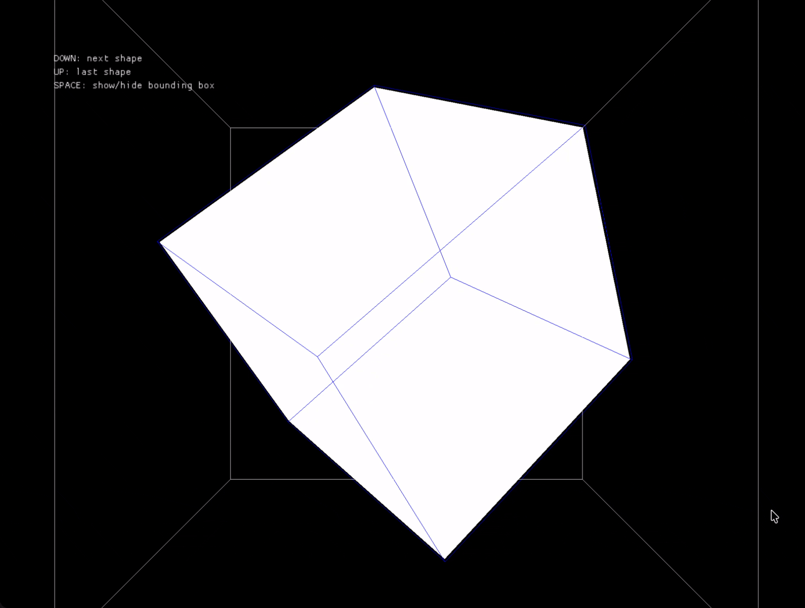

#### Triangle

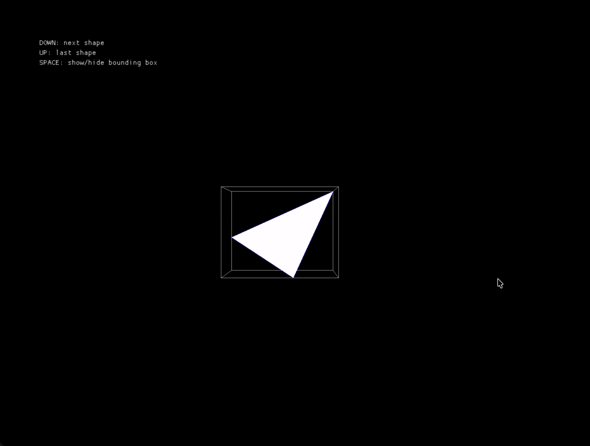

### Multiple shapes together

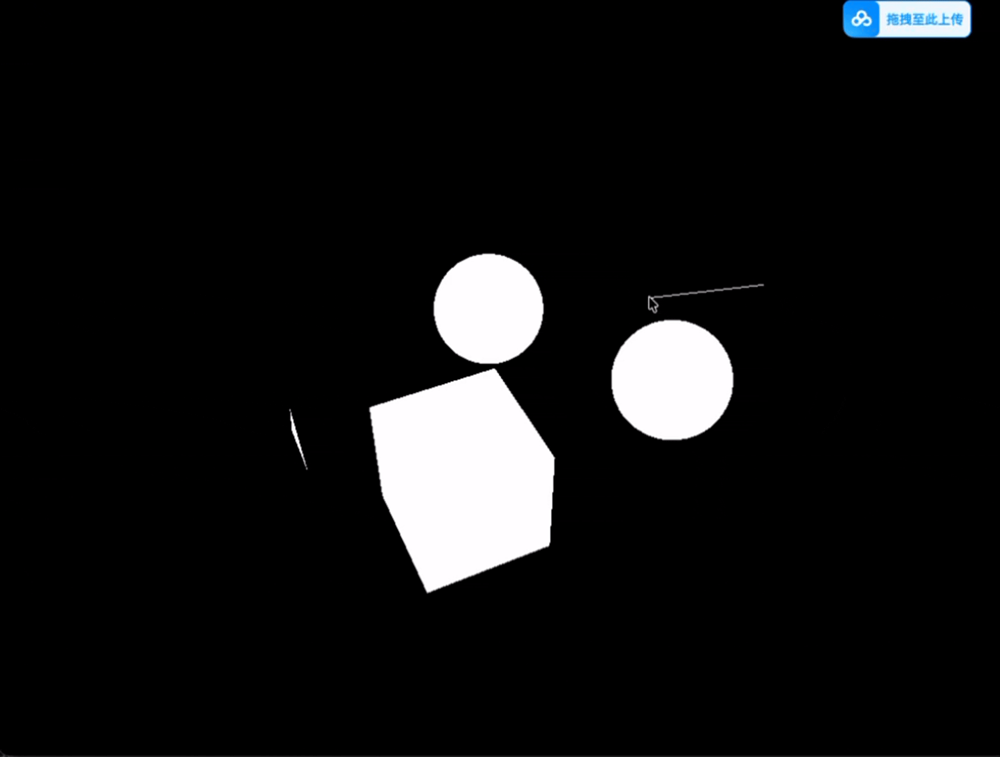

## Stage 2: Bounding Volume Hierarchy

The second stage introduces a bounding volume hierarchy (BVH) to accelerate the ray tracing process. The BVH implementation is in [`raytracing/bounding_volume_hierarchy.py`](raytracing/bounding_volume_hierarchy.py), with supporting utilities in [`raytracing/bvh_util/*.py`](raytracing/bvh_util).

This project explores four BVH construction methods:

- **Midpoint**: Splits primitives around the midpoint of the selected bounding-box extent.
- **Equal count**: Divides primitives into groups with approximately equal numbers of primitives.
- **Surface area heuristic (SAH)**: Chooses splits based on the estimated traversal and intersection cost.
- **Morton code**: Uses Morton codes to build the hierarchy linearly.

The construction methods are demonstrated in [`examples/bounding_volume_hierarchy.py`](examples/bounding_volume_hierarchy.py).

#### Controls

- **Left arrow**: Switch to the previous BVH construction method.
- **Right arrow**: Switch to the next BVH construction method.
- **Up arrow**: Move to the previous hierarchy level.
- **Down arrow**: Move to the next hierarchy level.

### BVH Construction Demos

#### Midpoint

#### Equal Count

#### Surface Area Heuristic

#### Morton Code

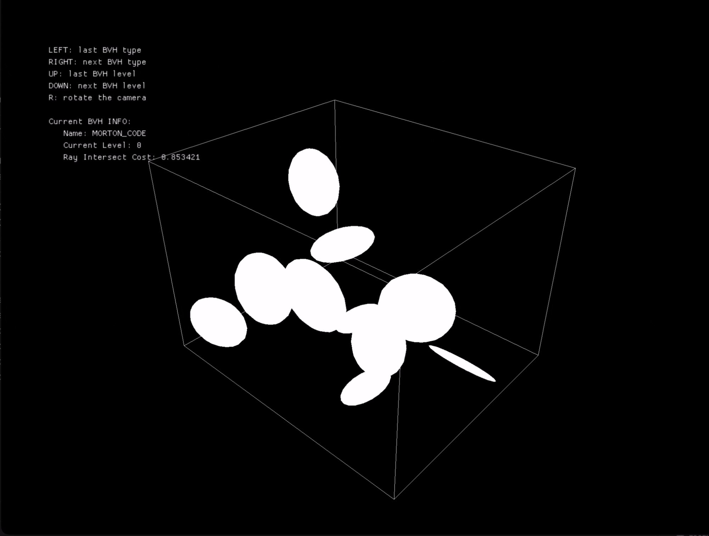

<<<<<<< HEAD
## Stage 3: Sampling Methods and Distributions
=======
## Stage 3: Monte Carlo Estimator and Sampling Methods
>>>>>>> 560fbdd (edit readme)

The third stage prepares the renderer for Monte Carlo integration by implementing sampling methods for common geometric domains. The sampling utilities are in [`raytracing/shapes/shape_sample_util.py`](raytracing/shapes/shape_sample_util.py).

This stage also implements sampling from specified one-dimensional and two-dimensional distributions in [`raytracing/distributon.py`](raytracing/distributon.py). The distribution sampling demo is [`examples/sample_distributions.py`](examples/sample_distributions.py).

### Shape Sampling Results

#### Sphere

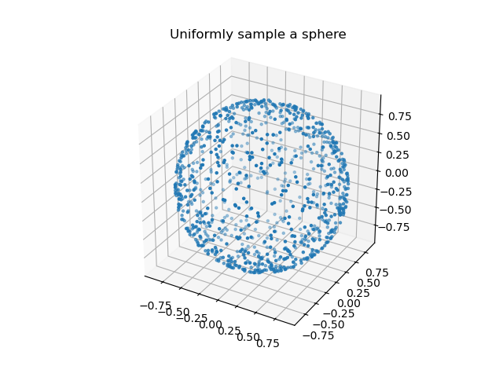

#### Hemisphere

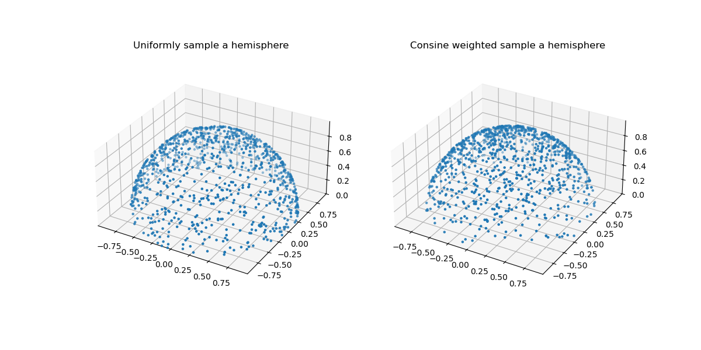

#### Disk

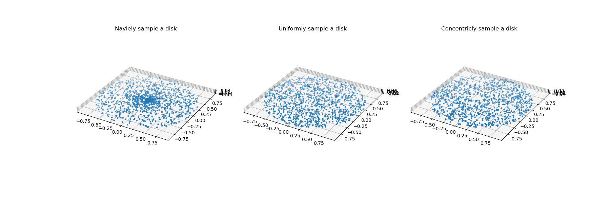

#### Cone

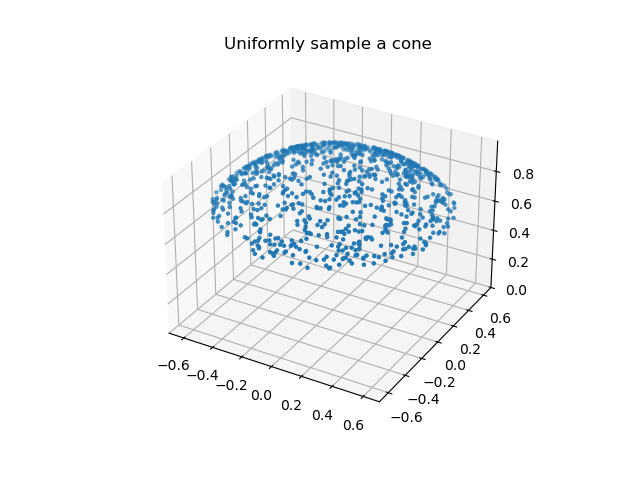

#### Triangle

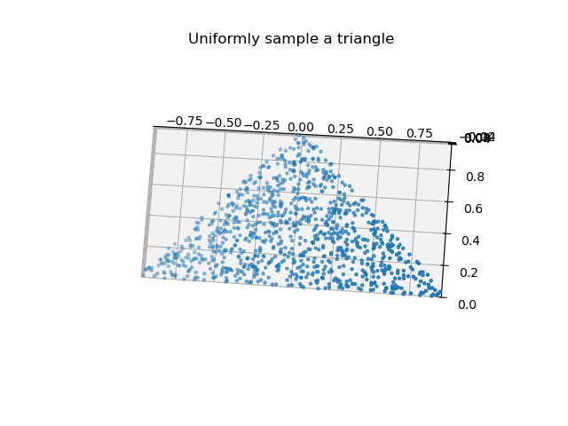

### Distribution Sampling Results

<<<<<<< HEAD
| One-dimensional distribution | Two-dimensional distribution |
| --- | --- |
| 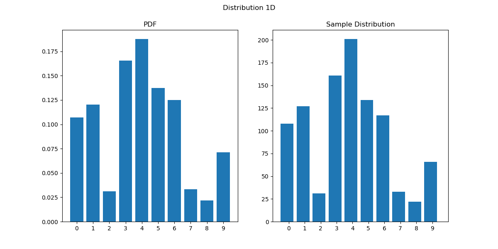 | 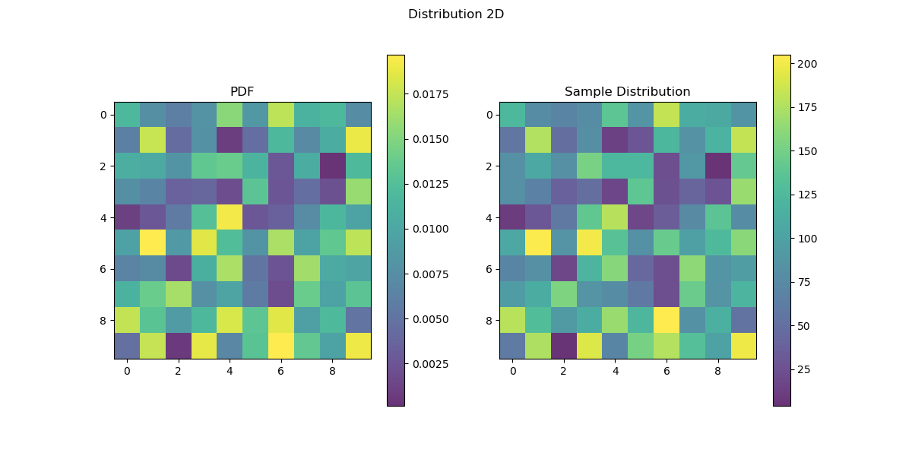 |
=======
#### One-Dimensional Distribution

#### Two-Dimensional Distribution

### Monte Carlo Integration

The next step applies Monte Carlo integration to estimate the integrals of `2x` and `cos(x)`. The estimator compares uniform sampling with a sampling method whose probability density function (PDF) is proportional to `cos(x)`. The implementation and experiment are in [`examples/monte_carlo_estimator.py`](examples/monte_carlo_estimator.py).

| Integrand | Uniform sampling | Cosine-proportional sampling |
| --- | --- | --- |
| `2x` | 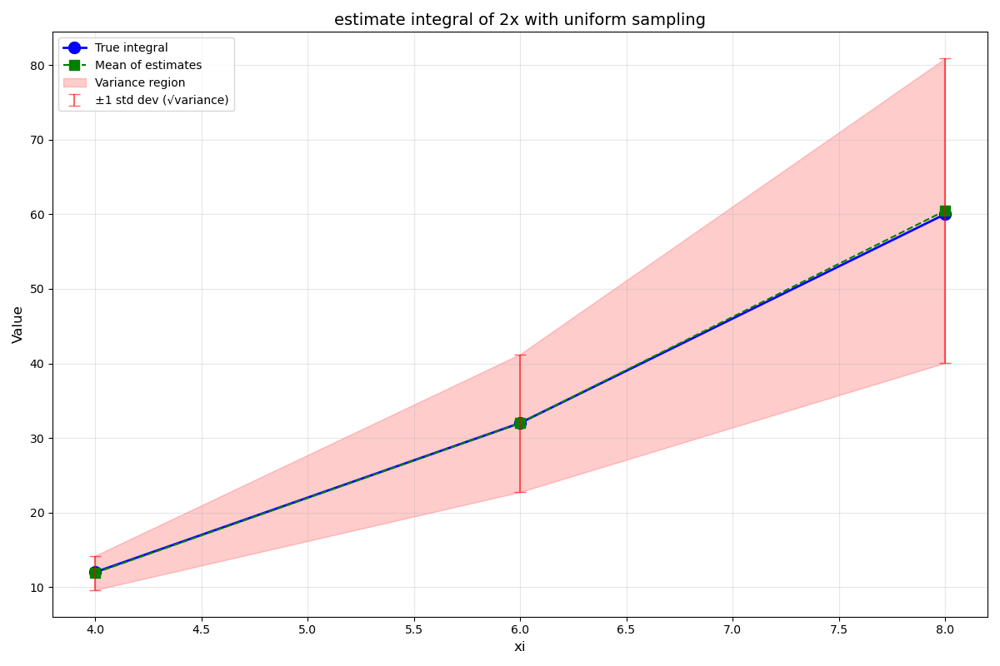 | 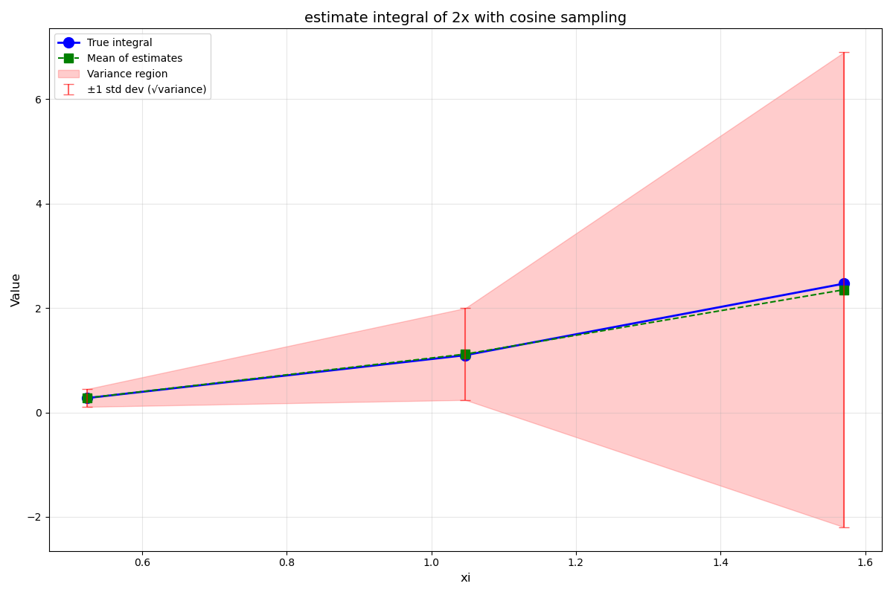 |
| `cos(x)` | 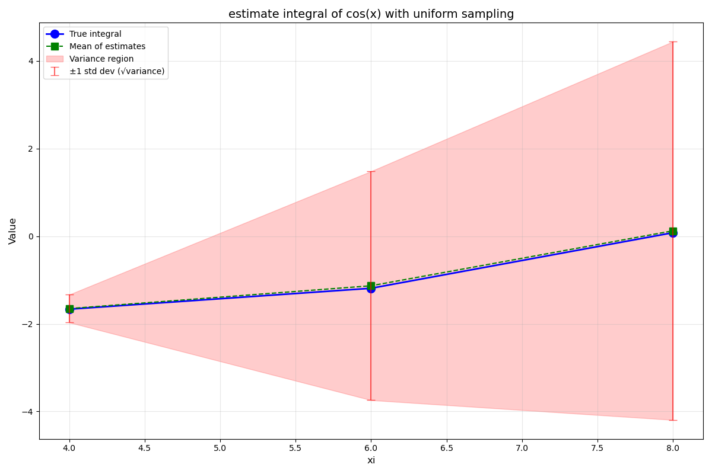 | 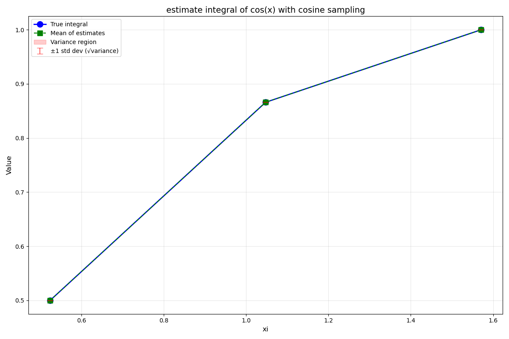 |

## Stage 4: Camera and Image Rendering

The fourth stage implements a custom camera that generates view rays and renders images directly, without requiring PyOpenGL for display. The camera implementation is in [`raytracing/camera.py`](raytracing/camera.py), with supporting camera utilities in [`raytracing/camera_util.py`](raytracing/camera_util.py).

The camera and image-rendering example is [`examples/camera_and_image.py`](examples/camera_and_image.py). It renders spheres, multiple spheres, a cube, and multiple triangles using the custom camera library.

### Camera Rendering Results

| Sphere | Multiple spheres |
| --- | --- |
| 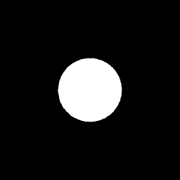 | 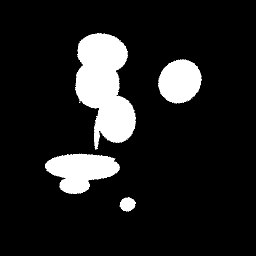 |
| Cube | Multiple triangles |
| 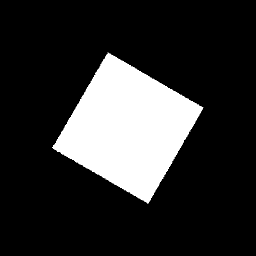 | 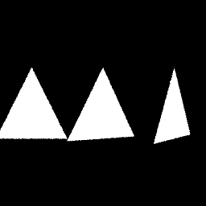 |

## Stage 5: Direct Lighting

The fifth stage implements direct lighting in [`raytracing/ray_tracers/direct_ray_tracer.py`](raytracing/ray_tracers/direct_ray_tracer.py). It introduces the Lambertian reflection model in [`raytracing/bxdfs/lambertian.py`](raytracing/bxdfs/lambertian.py), along with point, spot, and area light implementations in [`raytracing/lights`](raytracing/lights).

### Point Light Rendering Results

| Sphere | Cube |
| --- | --- |
| 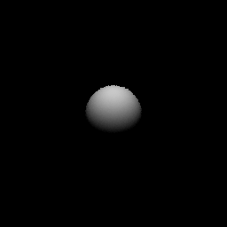 | 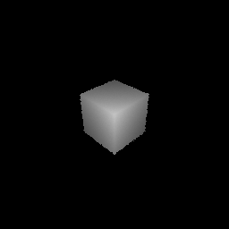 |
| Sphere and cube | Sphere, cube, and triangle |
| 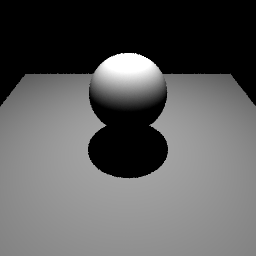 | 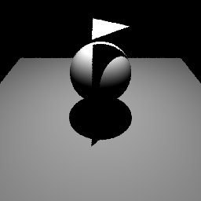 |

### Combined Scene with Different Light Sources

| Point light | Area light |
| --- | --- |
|  | 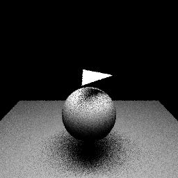 |
| Sphere, cube, and triangle with spot light | Rabbit with spot light |
| 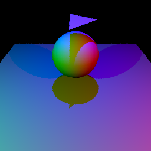 | 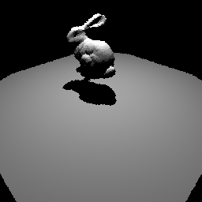 |

## Stage 6: Indirect Lighting

The next stage implements indirect lighting in [`raytracing/ray_tracers/path_tracer.py`](raytracing/ray_tracers/path_tracer.py). Unlike direct lighting, indirect lighting accounts for light that bounces between surfaces before reaching the camera.

### Indirect Lighting Example

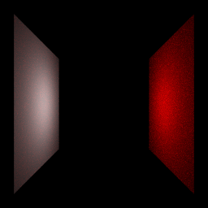

This simple example places a point light between a red square and a white square. The white square receives reflected light from the red square, demonstrating color bleeding caused by indirect illumination.

## To Be Continued

More rendering features and performance improvements are planned for future stages.
>>>>>>> 560fbdd (edit readme)
